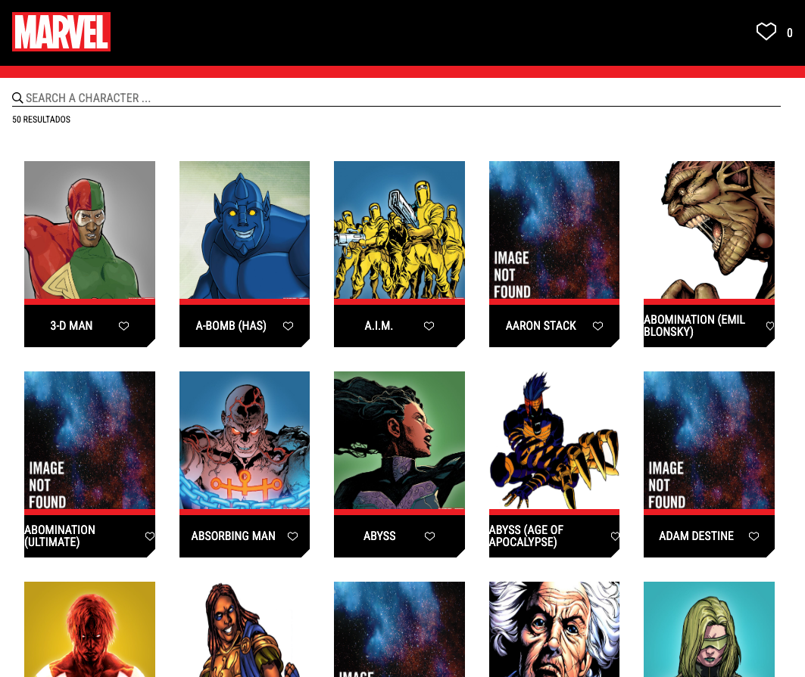

# MARVEL WebApp - Arturo Martínez Díaz

Visit it at: https://wolfchamane.github.io/marvelwebapp/

Or at: https://wolfchamane.com/marvelwebapp/

Version: **0.1.6**



> [!NOTE]
> This application was part of a job interview process.

## Features

Fetches information from https://gateway.marvel.com/ API to create a web application where user can:
- List over 50 characters.
- Get detailed information about any of them.
- Mark his/her favourites.

## ToDo's

- [ ] Support user's session storage.
- [ ] Add unitary & e2e tests.
- [ ] Extend character's details.
- [ ] Add landing/exploring page with multiple collections.
- [ ] Support pagination.
- [ ] Support advanced filtering.

## Technology stack

This web application has been developed using:

- [React](https://react.dev/) + [React Router](https://reactrouter.com/) + [Redux](https://redux.js.org/), as primary libraries for development.
- [Typescript](https://www.typescriptlang.org/) & [SaSS](https://sass-lang.com/) syntaxes for enhanced EMACScript and CSS.
- [Vite](https://vite.dev/) as primary utility for development.
- [eslint](https://eslint.org/) and [prettier](https://prettier.io/) for source code linting and format.

## Run locally

### With any static server solution

> Notice: I'll be using `http-server` for this example

Run the following:

```bash
npm run build-only
# We need to create the fake URL path of the end domain
mkdir -p dist/marvelwebapp
mv dist/assets/ dist/marvelwebapp/
mv dist/index.html dist/marvelwebapp/
# Now we can serve the statics
cd dist
http-server
```

Then open your browser at http://127.0.0.1:8080/marvelwebapp/.

### Within Docker

Run the following:

```bash
docker build --build-arg API_KEY=${your_api_key_here} -t marvelwebapp .
docker run -d -p 8080:80 marvelwebapp
```

Then open your browser at http://localhost:8080/.

## LICENSE

About web application:
> See [LICENSE](LICENSE) file for information about **only** the web application.

About API and it's content:
> [Data provided by Marvel. © 2025 MARVEL](https://marvel.com)


